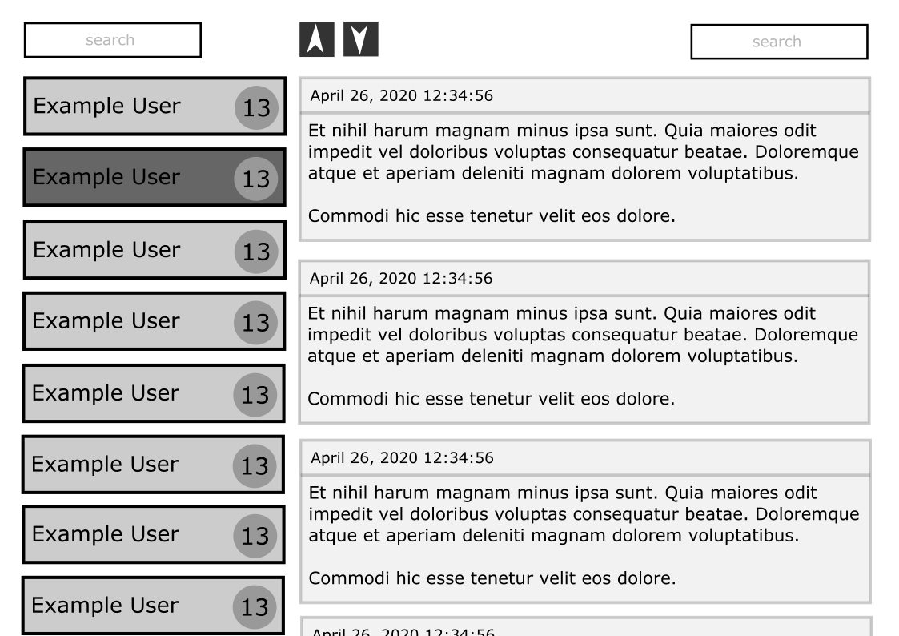

# Post Reader SPA

## Task:
* Create a simple post reader as a React SPA.
* Implement above using React components and CSS3.
* Retrieve the data shown in the app from the API described below.
* Concentrate on functionality, code quality and testability, not appearance.
* Any common state management, routing and/or testing library can be used.
* Using CSS toolkits and UI frameworks (bootstrap etc) is not ok. The purpose is to evaluate your coding skills, not npm skills.
Must haves:
* Login Screen with email and name inputs.
* Sender list with sender name and post count ordered by name alphabetically.
* Clicking on a sender opens that sender's posts in the post list view.
* Post list where posts are ordered by creation time.
* Post order buttons to allow choosing most recent first and most recent last ordering for posts list
Nice to haves:
* Search box for senders. Any senders whose name do not contain the text entered are hidden
* Search box for posts. Any posts that do not contain the text entered are hidden
* Deep-linkable post list. This means that it is possible to enter a URL that directly selects the sender whose posts are shown.

## Setup
* clone/download and cd post-reader-spa
* npm install
* npm run server
* npm run start
* access http://localhost:3000/users

## Example

## Contact
[@jorgepezzuol](https://www.linkedin.com/in/jorge-pezzuol/)
